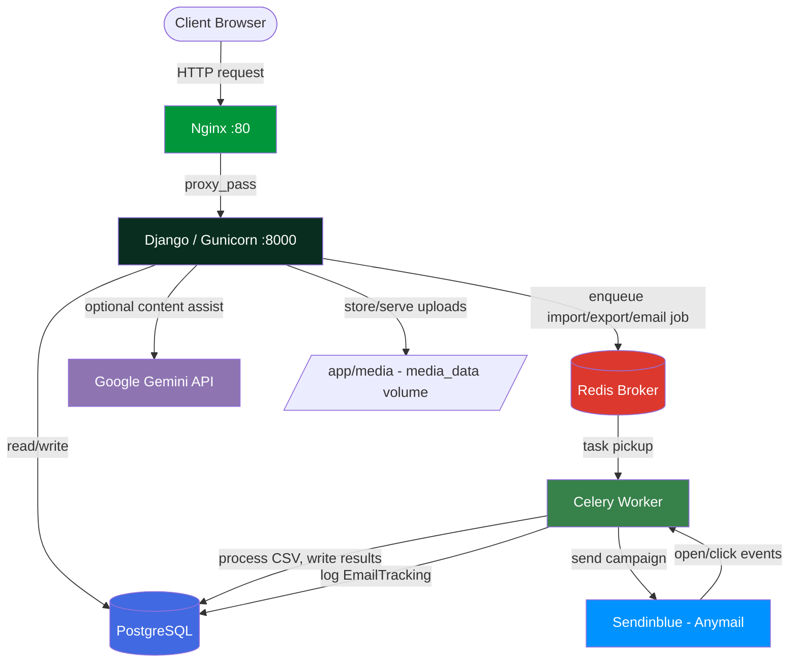

# 📊 AWD — Data & Email Automation Platform

A Django-based platform for organizations to import/export structured business data (employees, students) and run tracked bulk email campaigns, with subscription-based usage limits and async background processing.


---

## ✨ Features

- **CSV data import/export** – Upload CSVs for domain models like `Student` and `Employee` through a web UI, with server-side validation before processing.
- **Async job processing** – Imports, exports, and email sends run in the background via Celery so the UI stays responsive, with a history log tracking success/failed/processing states.
- **Subscription-based usage limits** – Per-user `SubscriptionPlan` and `UserSubscription` records enforce per-day limits on imports, exports, and emails via `DailyUsage` tracking.
- **Bulk email campaigns** – Build subscriber lists (`List`, `Subscriber`), compose HTML emails with CKEditor, and send them asynchronously through Sendinblue (via Anymail).
- **Open/click tracking** – Each campaign is tracked via `EmailTracking`, with dashboards for engagement metrics.
- **AI-assisted email content (optional)** – Google Gemini API integration to help draft email content when `GEMINI_API_KEY` is configured.

---

## 🏗️ Architecture



**How it flows:**

1. The client hits Nginx on port 80, which reverse-proxies the request to the Django app running under Gunicorn on port 8000.
2. Django handles auth, dashboards, and form submissions directly against PostgreSQL for standard reads/writes.
3. CSV import/export jobs and bulk email sends are pushed onto Redis as Celery tasks instead of running inline.
4. The Celery worker picks up the task, processes the CSV or sends the campaign through Sendinblue (via Anymail), and writes job status or `EmailTracking` results back to PostgreSQL.
5. Optional AI-assisted email drafting calls the Gemini API directly from the web process; uploaded files and email attachments are stored in the `media_data` volume.

---

## 🛠️ Tech Stack

| Layer               | Technology                          |
|----------------------|--------------------------------------|
| Backend framework    | Django (custom user model)          |
| WSGI server          | Gunicorn                            |
| Reverse proxy        | Nginx                               |
| Database             | PostgreSQL                          |
| Task queue / broker  | Celery + Redis                      |
| Static files         | WhiteNoise                          |
| Rich text editing    | CKEditor                            |
| Email delivery       | Sendinblue (via Anymail)            |
| AI content assist    | Google Gemini API (optional)        |
| Containerization     | Docker / Docker Compose             |
| Config management    | python-decouple (`.env`)            |

---

## 🚀 Run Locally / Getting Started

### 1. Clone the repository

```bash
git clone <https://github.com/anirudhkhemriyaa/AWD.git> AWD
cd AWD
```

### 2. Create the `.env` file

```env
# --- Django ---
SECRET_KEY=change-me-to-a-strong-secret-key
DEBUG=True

# External URL used in links / tracking
BASE_URL=http://localhost
CSRF_TRUSTED_ORIGINS=http://localhost

# --- PostgreSQL (used by db container and Django) ---
POSTGRES_DB=awd
POSTGRES_USER=awd
POSTGRES_PASSWORD=awdpassword
POSTGRES_HOST=db
POSTGRES_PORT=5432

# --- Redis / Celery ---
REDIS_URL=redis://redis:6379/0

# --- Email (Sendinblue via Anymail) ---
SENDINBLUE_API_KEY=your-sendinblue-api-key

# --- Optional: Google Gemini API for AI features ---
GEMINI_API_KEY=your-gemini-api-key
```

### 3. Build the images

```bash
docker compose build
```

### 4. Run database migrations

```bash
docker compose run --rm web python manage.py migrate
```

### 5. Create a superuser

```bash
docker compose run --rm web python manage.py createsuperuser
```

### 6. Start the full stack

```bash
docker compose up -d
```

### 7. Access the application

| View            | URL                     |
|------------------|--------------------------|
| Main site        | `http://localhost`      |
| Admin panel      | `http://localhost/admin`|

To tail logs for a specific service:

```bash
docker compose logs -f web
docker compose logs -f celery
docker compose logs -f db
```

To stop the stack:

```bash
docker compose down
```

---

## 📓 Notes

- Data persists in Docker volumes (`postgres_data`, `media_data`) across `docker compose down`; use `docker compose down -v` to also remove volumes.
- `SECRET_KEY` and `POSTGRES_PASSWORD` should be replaced with strong, unique values outside local development.
- Static files are collected into `/app/staticfiles` at image build time (`collectstatic --noinput`); user uploads (email attachments, etc.) live in `/app/media`, backed by `media_data`.
- `GEMINI_API_KEY` is optional — AI-assisted email content only activates if it's set.
- All Django management commands can be run via `docker compose run --rm web python manage.py <command>`.

---

<p align="center">
  Built by <a href="https://github.com/anirudhkhemriyaa">anirudhkhemriyaa</a>
</p>
